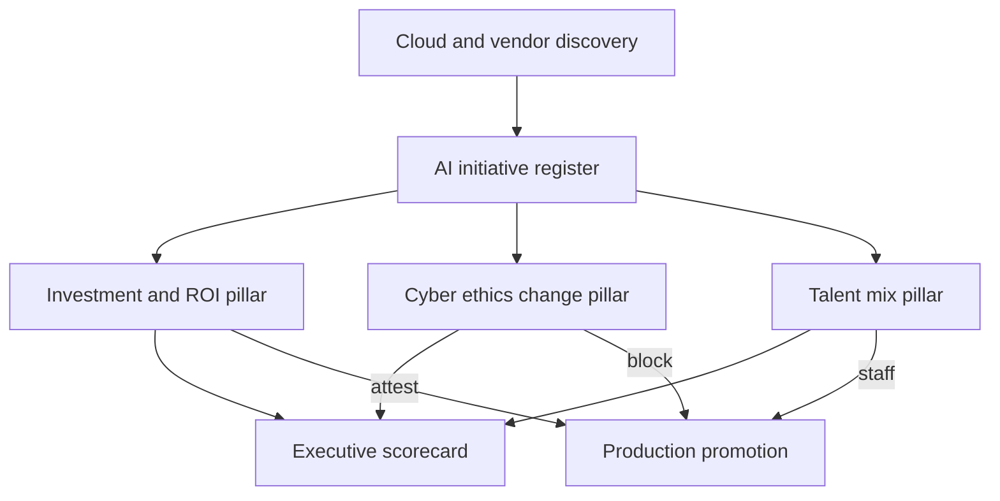

# Triara

**Source:** `ai-in-enterprise/deloitte-DI_State-of-ai-in-the-enterprise-2nd-ed/`
**Domain:** `ai-enterprise`
**One-liner:** An early-adopter AI portfolio operating system that forces enterprises to get serious across three linked pillars — investment and ROI honesty, cyber/ethics/change risk, and the right talent mix — so bullish pilots become governed production value.
**Wedge:** US enterprises already running six-plus AI pilots and claiming positive ROI (the Deloitte 2018 early-adopter cohort) whose executives are still short on cyber gates, ethics review, and non-technical use-case selectors.
**Positioning:** Early-adopter AI programme control plane. Differentiates from Adoptra (5As change journey), Operum (intelligent-ops multi-tower readiness), Valorink (insights value-chain P&L), Cognpulse (2017 first-wave cognitive pulse), and Quantara (ML project ROI calculator). Triara’s thesis is the 2nd-edition finding set: enthusiasm is high, but returns peak only when companies balance excitement with risk, change, and talent execution.

## Market research synthesis

### Thesis from source

Deloitte’s *State of AI in the Enterprise, 2nd Edition* surveyed 1,100 IT and line-of-business executives in Q3 2018 — all knowledgeable about cognitive/AI, 90% directly involved in strategy or spend, 64% C-level. Early adopters remain bullish: cloud-based cognitive services are lowering the cost to start; companies are launching more initiatives and reporting positive returns. Deep learning use reached 50% of respondents; NLP adoption rose to 62% from 53%; machine learning sat at 63% (up five points from 2017). Fifty-five percent launched six or more pilots (up from 35%); 58% claim six or more full implementations (up from 32%). Median reported ROI across the study is striking (the source cites figures around 48% in places), yet fewer than half of respondents rigorously track project budget, ROI, and production targets — so claimed returns need governance, not applause.

The report’s three findings define the product. (1) **Investment and activity are rising**, aided by cloud cognitive services, but executives are more realistic about transformation timelines (56% expect company transformation within three years, down from 76% in 2017). (2) **Risk and change management** must improve: implementation challenges and integrating AI into roles/functions top the challenge list; cybersecurity vulnerabilities rank as a top concern (23% ranked cyber as a top-three challenge) and have already stopped some initiatives; ethical risks and “last mile” behaviour change are under-managed. (3) **Talent mix**, not just headcount: firms lack AI researchers and programmers *and* business leaders who can select the best use cases; many train existing staff while others feel they must replace workers; the strategic approach is to automate what machines do best while capitalising on human judgement.

Triara turns those three findings into operating pillars with gates: no scale funding without ROI instrumentation; no production without cyber and ethics clearance; no portfolio expansion without a named use-case selector and skills plan.

### Buyer & economic model

- **Primary buyer:** Chief AI Officer, CIO, or Transformation lead accountable for enterprise AI spend at a cognitive-active company.
- **Users:** AI programme PMO; cyber and risk; ethics/compliance; HR/talent for AI roles; LOB sponsors; finance for ROI attestation.
- **Budget owner / value metric:** Enterprise AI / digital budget. Value metric is *verified production outcomes per dollar* and *share of initiatives that cleared risk and talent gates before scale* — not pilot count.
- **Competing status quo:** Slide-based AI steering committees; separate GRC tools that never see model inventories; HR requisitions disconnected from use-case demand; finance spreadsheets that accept self-reported ROI.

### Domain constraints

- **Regulatory / trust / safety:** Cyber vulnerabilities in AI stacks; ethical use of customer and employee data; audit expectations for claimed ROI.
- **Data sensitivity:** Model inventories and cyber findings are highly sensitive; individual performance data from “replace vs retrain” decisions is labour-sensitive.
- **Change-management realities:** Bullish culture resists gates; LOBs bypass central review via cloud credits; vendors sell pilots that never enter the risk register.

## Business requirements

- BR-1: Every AI initiative is registered with objective, spend, technology class (ML, deep learning, NLP, etc.), and stage (pilot, implementation, production).
- BR-2: ROI claims require instrumented baselines and production targets; uninstrumented claims are labelled *claimed*, never *verified*.
- BR-3: Scale funding above a policy threshold requires verified ROI or an explicit learning-budget waiver.
- BR-4: Cyber risk assessment is mandatory before production; open critical cyber findings block go-live.
- BR-5: Ethics review is mandatory for initiatives touching customers, employees, or regulated decisions.
- BR-6: Change plan must name role impacts and last-mile behaviour owners; missing plans block “integrated into roles” status.
- BR-7: Talent plans distinguish technical skills from use-case selector capacity; vacancies in selector roles flag portfolio risk.
- BR-8: Cloud cognitive service usage is inventoried so shadow pilots enter the register within a defined SLA.
- BR-9: Challenge taxonomy (implementation, integration, measurement, cyber, ethics, talent) is scored quarterly for the portfolio.
- BR-10: Competitive-advantage narratives require evidence links to production outcomes.
- BR-11: Workforce impact (augment vs replace) is recorded at initiative level for HR and works-council reporting.
- BR-12: Executive scorecards reconcile spend, verified ROI, blocked-by-risk count, and talent gaps.

## User stories

Canonical user stories live in sibling [USER_STORIES.md](USER_STORIES.md).

## System design

### Overview

Triara runs an initiative register with three gate stacks — Investment/ROI, Risk (cyber, ethics, change), and Talent — plus a portfolio scorecard. Cloud spend and vendor pilots feed discovery. Production promotion requires clearing the stacks or recording waivers. Executive packs reconcile the three pillars.

### Actors & boundaries

- **Actors:** CAIO, PMO, cyber, ethics, HR, LOB sponsors, finance, vendors (via API inventory only).
- **Trust boundary:** Cyber findings and ethics cases restricted; workforce flags aggregated for external reporting.
- **Human-in-the-loop points:** ROI verification, cyber/ethics clearance, scale waivers, talent plan approval.

### Core capabilities

1. Initiative portfolio register
2. Spend and cloud cognitive discovery
3. ROI instrumentation and attestation
4. Cyber risk gating
5. Ethics review gating
6. Change / role-integration plans
7. Talent mix and selector capacity
8. Challenge taxonomy scoring
9. Executive scorecards
10. Audit and waiver governance

### Conceptual data

- **Primary entities:** AiInitiative, TechnologyClass, SpendRecord, RoiAttestation, CyberAssessment, EthicsReview, ChangePlan, TalentPlan, SkillGap, PortfolioScorecard, Waiver, AuditEntry.
- **Critical events:** initiative registered; spend discovered; ROI attested; cyber/ethics cleared or blocked; talent gap opened; scale approved; waiver granted.
- **Retention / audit needs:** Attestations, waivers, and gate decisions retained for audit horizon.

### Integrations (conceptual)

- **Systems of record:** Cloud billing; GRC; HRIS; finance; ML ops inventories.
- **Upstream signals:** Pilot launches, cyber scans, hiring pipelines.
- **Downstream actions:** Go-live blocks, funding releases, hiring reqs, board packs.

### High-level architecture

### Success metrics

- **Leading:** % initiatives with instrumented ROI; median days in cyber/ethics review; selector-role fill rate; shadow-pilot discovery SLA.
- **Lagging:** Verified production outcomes per $; initiatives blocked then remediated; transformation timeline realism vs prior-year bullishness.

## OpenAPI skeleton

Canonical HTTP surface lives in sibling `openapi.yaml`. Summarize here:

- **Base path:** `/v1/...`
- **Auth:** `ApiKeyAuth` for cloud/GRC/HRIS integrations; `BearerAuth` for CAIO, risk, HR, finance, sponsors.
- **Resource groups:** Initiatives, Investment, Risk, Ethics, Talent, Scorecards, Waivers, Governance.
