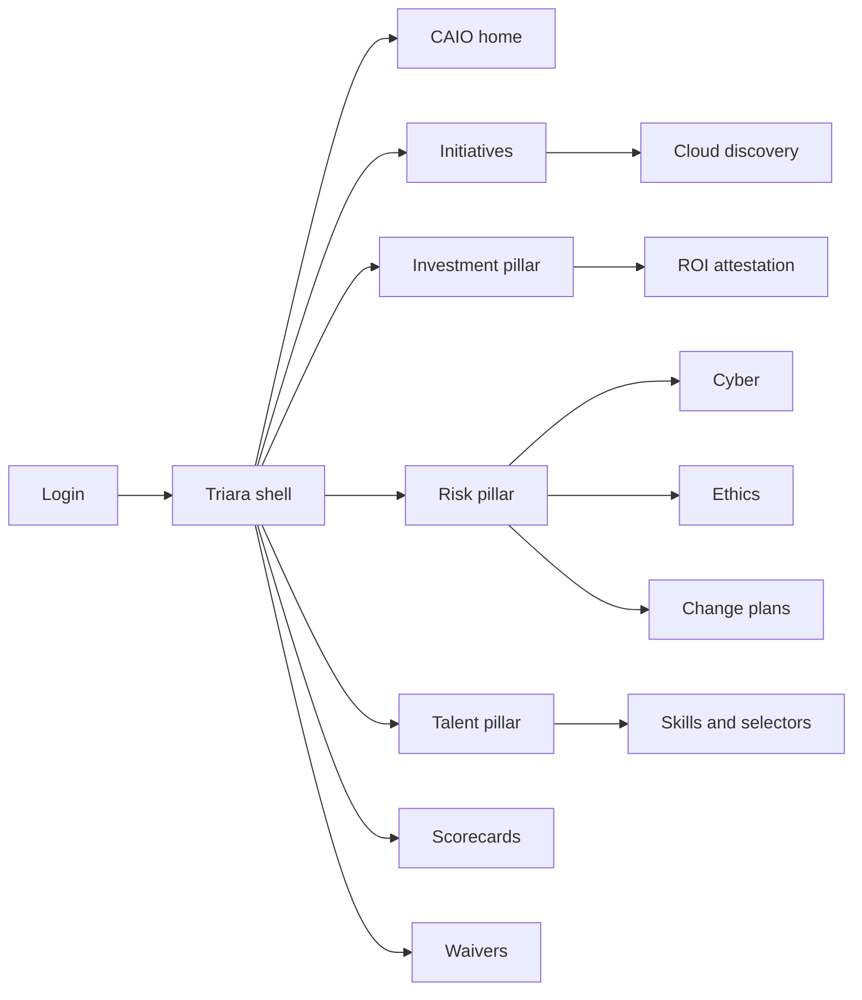
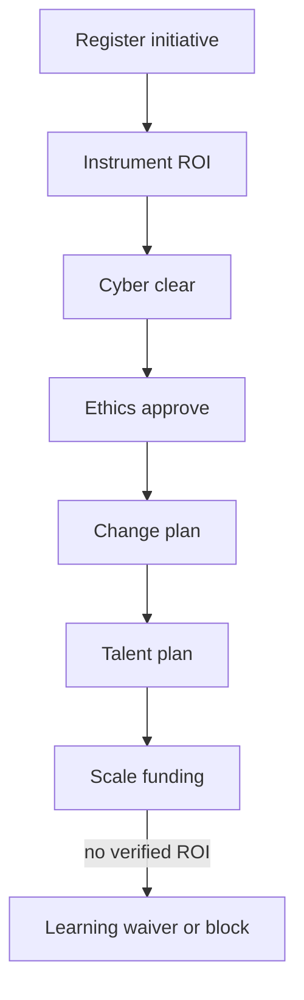

# Triara — Web app

**Product:** [PRODUCT.md](./PRODUCT.md)
**Primary surface:** CAIO / AI programme console (Investment · Risk · Talent pillars)
**Secondary surfaces:** Sponsor gate status portal; finance ROI attestation desk
**Design thesis:** Triara is a three-pillar tripod for early-adopter AI programmes — the UI metaphor is a balanced stand (Investment/ROI honesty, Cyber·Ethics·Change risk, Talent mix) where removing any leg collapses scale funding. Visual language is cool slate with verified-teal for attested ROI, cyber-coral for production blocks, and selector-amber for talent gaps; “claimed” vs “verified” is never styled the same. The brand wordmark sits on every scorecard and go-live gate so executives know bullish pilots are not the product — governed production value is.

## UX research synthesis

### Category peers (best-in-class)

- **ServiceNow AI Control Tower / SPM:** Initiative register with stage and executive scorecards. Steal: single portfolio truth across LOBs; reject IT-only demand jargon where Triara needs ML/DL/NLP classes and claimed-vs-verified ROI.
- **OneTrust / Credo AI ethics gates:** Mandatory ethics review before production for people-affecting systems. Steal: ethics clearance as hard go-live gate; reject policy-PDF libraries as the only surface.
- **Wiz / cloud security posture for AI stacks:** Critical findings that block deploy. Steal: open critical cyber → production lock; reject generic CVE lists disconnected from model inventory.
- **Workday / Eightfold talent planning:** Skills gaps beside reqs. Steal: selector-role capacity next to engineer gaps; reject headcount-only hiring dashboards.

### Patterns to adopt / reject

- **Adopt:** Three-pillar scorecard as home; claimed ≠ verified styling; shadow cloud-spend discovery; cyber/ethics blocks; change plans with last-mile owners; learning-budget waivers explicit; augment-vs-replace flags.
- **Reject:** Pilot-count vanity; median “48% ROI” self-certify; purple AI enthusiasm panels; scale without instrumentation; GRC tools that never see the initiative register.

### Trust, density, and workflow constraints from PRODUCT.md

Cyber findings and ethics cases are restricted. Workforce replace flags are labour-sensitive — aggregate externally. Bullish culture will try to bypass gates via cloud credits (BR-8). Density is programme-grade on CAIO home; sponsors see gate status without full cyber detail; finance sees attestation only.

## Information architecture

### Nav model

### Roles → default home

| Role | Default home | Why |
|------|--------------|-----|
| Chief AI Officer / CIO | CAIO home — three-pillar scorecard | One truth (BR-12) |
| AI programme PMO | Initiative register | Stages and discovery (BR-1, BR-8) |
| Cyber / risk | Cyber assessments | Production blocks (BR-4) |
| Ethics / compliance | Ethics reviews | Customer/employee gates (BR-5) |
| LOB sponsor | Gate status on my initiatives | Waiting on which pillar |
| Talent / HR | Talent plans | Selector vs engineer gaps (BR-7, BR-11) |
| Finance | ROI attestation queue | Verified vs claimed (BR-2, BR-3) |

### Cross-links to OpenAPI resources

| Nav area | OpenAPI tags / resources |
|----------|---------------------------|
| Initiative register, stages | Initiatives |
| Spend, ROI attestations | Investment |
| Cyber assessments | Risk |
| Ethics reviews | Ethics |
| Talent plans, skill gaps | Talent |
| Executive scorecards | Scorecards |
| Learning-budget / scale waivers | Waivers |
| Audit entries | Governance |

## Screen inventory

### CAIO home

- **Purpose:** Answer “are we balancing excitement with ROI honesty, risk, and talent — or just launching pilots?” in one composition.
- **Entry:** CAIO post-login.
- **Layout regions:** Brand + period; tripod strip (verified ROI rate, blocked-by-risk count, selector gaps, shadow pilots pending); pillar health glyphs; alerts (critical cyber, ethics overdue, scale without attestation).
- **Primary actions:** Open blocked initiative; issue scorecard; grant/deny waiver.
- **Empty / loading / error:** Empty = import cloud spend + register first initiative; loading = tripod skeletons; error = retry with request id.
- **BR / story ties:** BR-9, BR-12; CAIO stories.

### Initiative register

- **Purpose:** Every AI initiative with objective, spend, tech class, stage (pilot → implementation → production).
- **Entry:** PMO default.
- **Layout regions:** Filterable table; tech class chips (ML, DL, NLP…); gate status columns; discovery source.
- **Primary actions:** Register; advance stage; open gates; merge shadow pilot.
- **Empty / loading / error:** Empty = templates; duplicate cloud project = merge prompt.
- **BR / story ties:** BR-1, BR-8.

### Cloud cognitive discovery

- **Purpose:** Inventory cloud cognitive usage; pull shadow pilots into register within SLA.
- **Entry:** Portfolio → Discover; billing integration.
- **Layout regions:** Unregistered spend list; SLA countdown; map-to-initiative.
- **Primary actions:** Register; assign sponsor; escalate overdue.
- **Empty / loading / error:** Empty = “no shadow spend”; overdue = coral.
- **BR / story ties:** BR-8.

### ROI instrumentation and attestation

- **Purpose:** Baselines and production targets; claimed vs verified labels; finance attest.
- **Entry:** Investment pillar; finance home.
- **Layout regions:** Claim queue; baseline/target form; verified ledger (immutable); learning-budget waiver link.
- **Primary actions:** Submit claim; attest; reject to claimed-only; request waiver for scale.
- **Empty / loading / error:** Uninstrumented = cannot show verified styling.
- **BR / story ties:** BR-2, BR-3; finance stories.

### Scale funding gate

- **Purpose:** Block scale above threshold without verified ROI or explicit waiver.
- **Entry:** Stage advance to scale; CAIO alert.
- **Layout regions:** Threshold policy; verified evidence or waiver; approve/deny.
- **Primary actions:** Approve scale; require attestation; grant learning waiver.
- **Empty / loading / error:** Missing both = hard block.
- **BR / story ties:** BR-3.

### Cyber risk assessments

- **Purpose:** Mandatory cyber before production; critical findings block go-live.
- **Entry:** Risk → Cyber.
- **Layout regions:** Assessment status; finding severity; clear workflow; block banner on initiative.
- **Primary actions:** Open assessment; clear finding; block/unblock go-live.
- **Empty / loading / error:** No assessment = production lock.
- **BR / story ties:** BR-4; cyber stories.

### Ethics reviews

- **Purpose:** Mandatory for customer, employee, or regulated decisions.
- **Entry:** Risk → Ethics.
- **Layout regions:** Review checklist; scope flags; approve/deny; evidence pack.
- **Primary actions:** Submit; approve; return with conditions.
- **Empty / loading / error:** In-scope without review = block.
- **BR / story ties:** BR-5.

### Change / role-integration plans

- **Purpose:** Role impacts and last-mile behaviour owners before “integrated into roles.”
- **Entry:** Risk → Change; sponsor.
- **Layout regions:** Role impact list; behaviour owners; integration status.
- **Primary actions:** Assign owners; mark integrated; block status if missing.
- **Empty / loading / error:** Missing plan = cannot claim integration.
- **BR / story ties:** BR-6.

### Talent mix and selector capacity

- **Purpose:** Technical skills vs use-case selector capacity; vacancies flag portfolio risk.
- **Entry:** Talent pillar; HR home.
- **Layout regions:** Skills matrix; selector role fill; engineer gaps; augment-vs-replace per initiative.
- **Primary actions:** Open req; flag gap; update workforce impact.
- **Empty / loading / error:** Selector vacancy on expanding portfolio = amber portfolio risk.
- **BR / story ties:** BR-7, BR-11; HR stories.

### Challenge taxonomy score

- **Purpose:** Quarterly score implementation, integration, measurement, cyber, ethics, talent challenges.
- **Entry:** CAIO → Score adjunct.
- **Layout regions:** Radar/bars by challenge; trend vs prior quarter; narrative.
- **Primary actions:** Publish quarterly; export.
- **Empty / loading / error:** Missing quarter = prompt PMO.
- **BR / story ties:** BR-9.

### Executive scorecard

- **Purpose:** Reconcile spend, verified ROI, blocked-by-risk, talent gaps; evidence for competitive-advantage claims.
- **Entry:** Scorecards nav; board export.
- **Layout regions:** Pillar tiles; spend vs verified outcomes; evidence links; pack export.
- **Primary actions:** Publish; challenge narrative without evidence (BR-10).
- **Empty / loading / error:** Narrative without production link = reject pattern.
- **BR / story ties:** BR-10, BR-12.

### Waivers desk

- **Purpose:** Explicit learning-budget and exceptional scale waivers with audit.
- **Entry:** Waivers nav; scale gate.
- **Layout regions:** Waiver queue; type; expiry; approver; retrospective.
- **Primary actions:** Grant; deny; expire.
- **Empty / loading / error:** Silent scale bypass impossible.
- **BR / story ties:** BR-3; finance waiver story.

### Sponsor gate status

- **Purpose:** LOB sees whether waiting on cyber, ethics, talent, or ROI — without full sensitive detail.
- **Entry:** Sponsor login.
- **Layout regions:** My initiatives; gate traffic lights; next action owner; claimed vs verified ROI.
- **Primary actions:** Upload evidence; ping owner; request waiver.
- **Empty / loading / error:** Empty = no sponsored initiatives.
- **BR / story ties:** Sponsor stories; BR-2.

## Key flows

1. **Pilot to production** — register → instrument ROI → cyber + ethics + change + talent → scale; failure: any critical gate blocks.

2. **Shadow cloud discovery** — billing signal → SLA → map to register → sponsor assigned.

3. **Claimed to verified ROI** — submit claim → finance attest → verified ledger; failure: remains claimed-styled.

4. **Critical cyber block** — finding opened → go-live lock → remediate → clear → unlock.

5. **Selector gap risk** — portfolio expand → selector vacancy → amber flag → hiring/training before new pilots.

## Design system

### Tokens (CSS variables)

- `--color-ink: #E8EEF4` — text
- `--color-slate-950: #0B1018` — ground
- `--color-slate-900: #141B26` — panels
- `--color-slate-700: #2C3A4E` — rules
- `--color-verified: #2BA67A` — verified ROI / cleared gates
- `--color-claimed: #8A93A3` — claimed-only (muted, never teal)
- `--color-cyber: #E4574D` — critical cyber / production block
- `--color-selector: #E0A23A` — talent / selector gap
- `--color-steel: #8B9BB0` — secondary
- `--color-brand: #9EB6D4` — Triara wordmark (cool tripod steel)
- `--font-display: "Outfit", sans-serif`
- `--font-mono: "IBM Plex Mono", monospace` — initiative ids, waiver ids
- `--space-1`…`--space-8`: 4px scale
- `--radius-sm: 4px`; `--radius-md: 8px`
- `--motion-block: 200ms ease-in` — go-live lock
- `--motion-attest: 180ms ease-out` — verified flash
- Atmosphere: three faint pillar lines in slate-900; no purple enthusiasm haze; no rainbow KPI tile farms.

### Typography & brand

- Display for pillar titles and verified %; mono for ids and attestations.
- Brand on scorecard and go-live; login: “Three pillars. Then scale.”; one CTA — no pilot-count hero stats.

### Do / don’t

- **Do:** Style claimed ≠ verified; block on critical cyber/ethics; show selector gaps; explicit waivers; shadow spend SLA.
- **Don’t:** Celebrate pilot volume; purple AI; self-certified ROI as verified; hide workforce impact; card grids of tech buzzwords.

### Accessibility & domain trust cues

- AA+ contrast; gates use icon + text.
- Live regions for production blocks and waiver expiry.
- Focus: register → ROI → risk → talent → scale.
- External HR exports aggregate replace flags.

## Component patterns

- **TripodScorecard** — Investment / Risk / Talent home composition.
- **ClaimedVerifiedToggle** — mutually exclusive ROI styling.
- **ShadowSpendQueue** — cloud discovery with SLA.
- **CyberBlockBanner** — coral production lock.
- **EthicsClearanceChip** — in-scope review state.
- **SelectorGapMeter** — use-case selector capacity.
- **AugmentReplaceFlag** — workforce impact at initiative.
- **LearningWaiverCard** — time-boxed honest experiment funding.

## Out of scope for v1 web

- Model training IDE; full SIEM; employee-facing chatbot; vendor marketplace; native mobile for CAIO; multi-tenant consultancy white-label of the programme OS.
